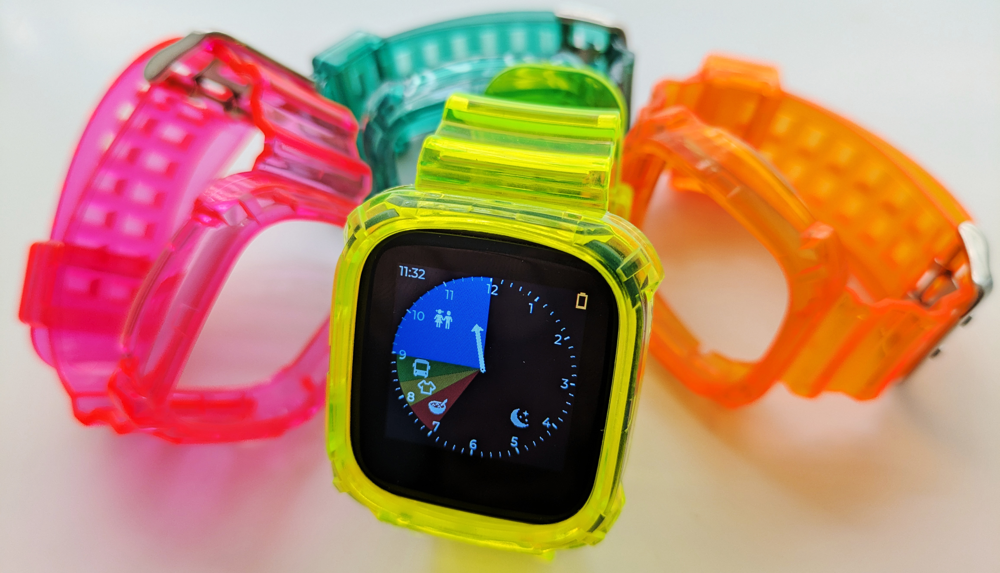

# ⌚ RoutineHero – A Smartwatch Experience for Kids

> **Forked from [InfiniTime](https://github.com/InfiniTimeOrg/InfiniTime)**  
> Full credit and thanks to the original InfiniTime team for their amazing open-source smartwatch firmware project!

---

## 📘 About

**RoutineHero** is a fun and structured smartwatch experience built for kids, based on the InfiniTime firmware.  
As a parent, you define a daily routine made up of activities — like brushing teeth, reading, playtime, etc. — and the watch guides your child throughout the day.

RoutineHero displays these activities visually as **segments on a pie chart over an analog-style clock face**, giving kids a sense of time and structure in a playful and intuitive way.

---

## 🎯 Key Features

- 🧭 **Analog Clock UI with Activity Pie Chart**  
  Each segment of the analog clock represents an activity in the child’s day.

- 👨‍👩‍👧‍👦 **Parent-Defined Routine**  
  Define your child’s daily routine with a simple config (custom app or BLE tool integration planned).

- 🔔 **Gentle Time Awareness**  
  Visual reminders help kids understand when it's time to transition to the next task.

- 🎨 **Kid-Friendly Design**  
  Clean, colorful UI tailored for younger users with simplified interactions.

- 💡 **Based on InfiniTime**  
  Leverages the powerful open-source firmware platform that runs on PineTime and compatible devices.

---

## 📱 Devices Supported

RoutineHero runs on devices compatible with InfiniTime, including:

- PineTime (nRF52832)
- Dev boards supporting BLE and compatible display controllers (with porting)

---

## 🚀 Getting Started

### Easiest way: Flash the pre-built DFU file

1. Download the latest DFU package from the repo:  
   [`doc/dfu/pinetime-mcuboot-app-dfu-1.15.0.zip`](doc/dfu/pinetime-mcuboot-app-dfu-1.15.0.zip)

2. Use a Bluetooth Low Energy (BLE) capable DFU tool to flash the firmware to your PineTime device, for example:
   - [Watchmate for Linux (works great for me)](https://github.com/azymohliad/watchmate)  
   - [nRF Connect (mobile app)](https://www.nordicsemi.com/Products/Development-tools/nrf-connect-for-mobile)  
   - [nRF Connect for Desktop](https://www.nordicsemi.com/Products/Development-tools/nrf-connect-for-desktop)

3. Follow the instructions in the DFU tool to upload the firmware to your watch over BLE.

---

### Building from source (optional)

If you want to build the firmware yourself:

1. **Clone the Repo**
   ```bash
   git clone https://github.com/trollderiu/InfiniTime-RoutineHero.git
   cd InfiniTime-RoutineHero
   ```

2. **Build the Firmware**  
   Follow the [InfiniTime build instructions](https://github.com/InfiniTimeOrg/InfiniTime#building-the-firmware), as they apply here too.
   ```bash
   docker pull --platform linux/amd64 infinitime/infinitime-build
   docker run --rm -it -v ${PWD}:/sources --user $(id -u):$(id -g) infinitime/infinitime-build
   ```

3. **Flash to Device**  
   Use your preferred method (DFU, SWD, etc.) to upload to your PineTime or compatible hardware.

---

## 📂 Project Structure

This project retains much of the original InfiniTime code, with key changes including:

- `src/display/RoutineHeroWatchFace.cpp` – Custom watchface with pie chart overlay
- `src/display/RoutineHeroTimer.cpp` – Screen with time left for the current activity
- `resources/images/` – Custom icons for kid-friendly interface

More detailed module descriptions coming soon.

---

## 🛠 Contributing

Want to help improve RoutineHero? PRs and suggestions are welcome!  
Check the [Issues](https://github.com/trollderiu/InfiniTime-RoutineHero/issues) tab for bugs and roadmap items.

---

## 🙏 Credits

RoutineHero is powered by:

- [InfiniTime](https://github.com/InfiniTimeOrg/InfiniTime) – Original firmware base
- [LittlevGL (LVGL)](https://lvgl.io/) – Embedded graphics library
- The open-source community ❤️

---

## 📄 License

RoutineHero inherits the [InfiniTime license](https://github.com/InfiniTimeOrg/InfiniTime/blob/develop/LICENSE) (Apache 2.0).